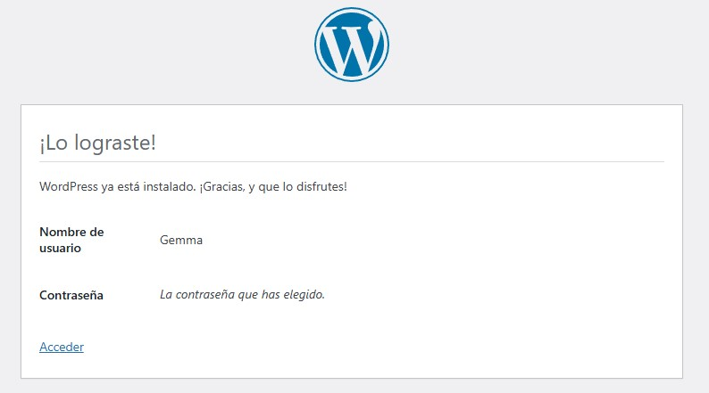
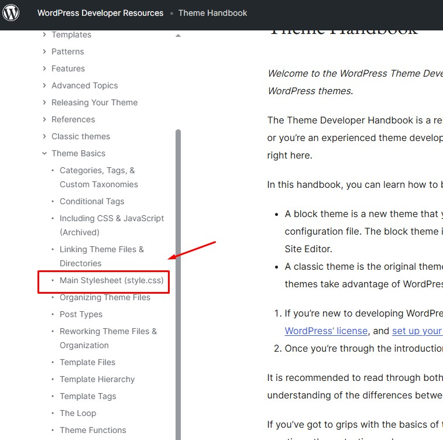
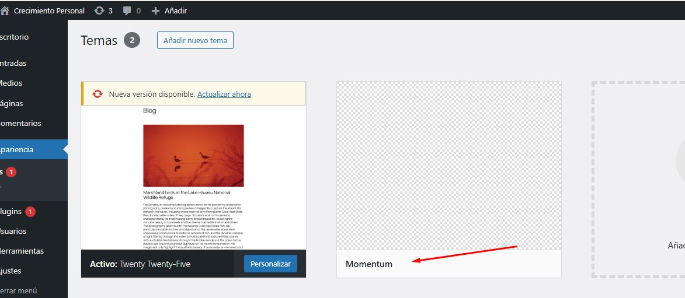
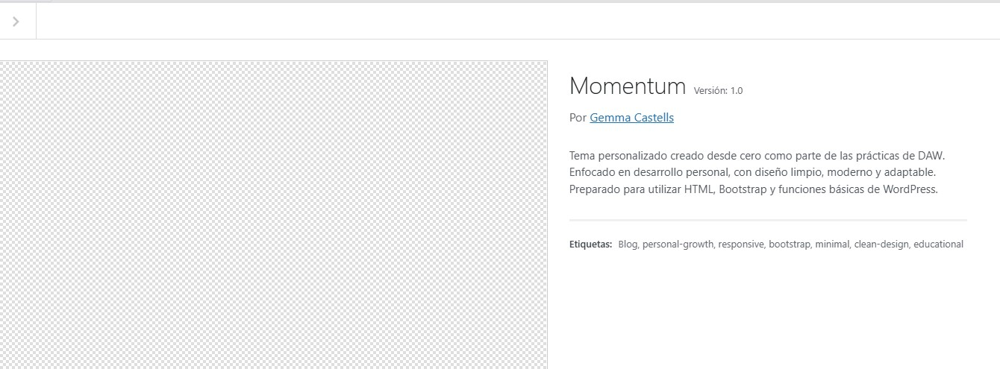
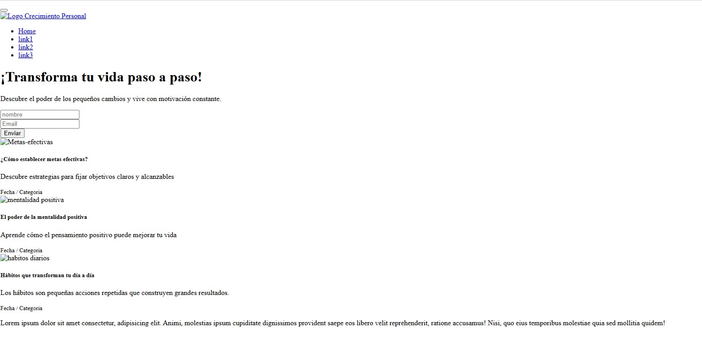
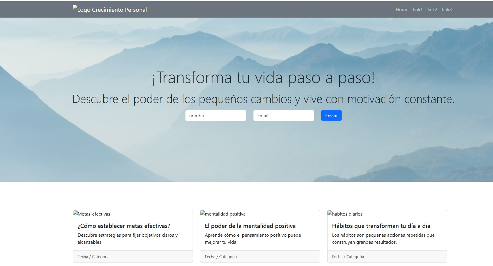
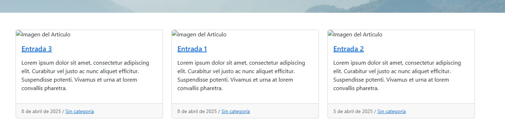
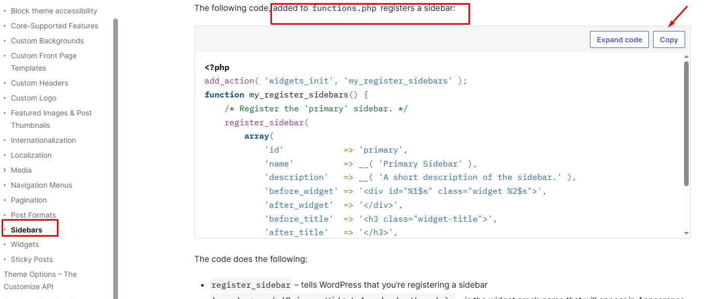
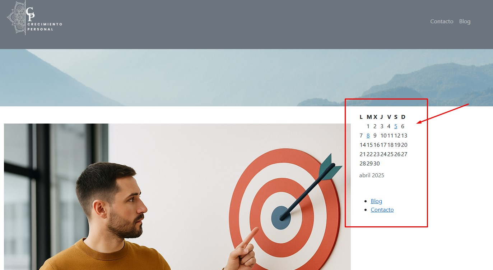

# 🎯 Tema Gemma (en desarrollo)

Práctica de la Semana 3 de DAW.

## 🎯 Objetivo

Crear una plantilla de WordPress desde cero.

---

## 📆 Instalación de WordPress y creación del tema Momentum

### 🔧 Paso 1: Instalación local de WordPress

- Descarga de WordPress desde [wordpress.org](https://wordpress.org)
- Instalación en local mediante XAMPP en:
  ```
  C:\xampp\htdocs\tema-gemma\
  ```

### 📁 Paso 2: Creación de base de datos

- Desde phpMyAdmin, se crea la base de datos `bd_gemma`
- Datos de conexión:
  - Usuario: `root`
  - Contraseña: *(vacía)*
  - Servidor: `localhost`
  - Prefijo de tabla: `wp_`

### 🌐 Paso 3: Instalación vía navegador

- Acceso a `http://localhost/tema-gemma`
- Se completa el asistente con:
  - Título del sitio: Crecimiento Personal
  - Usuario y contraseña
  - Correo electrónico
  - Visibilidad desmarcada para motores de búsqueda



---

## 📁 Estructura inicial del tema Momentum

### Creación de carpetas y archivos base

- En `wp-content/themes/` se crea la carpeta `Momentum`
- Estructura inicial:
  - `style.css`
  - `index.html`, `page.html`, `single.html`
  - `css/`, `js/`, `images/`

### Conversión a archivos WordPress

- `index.html` → `index.php`
- `page.html` → `page.php`
- `single.html` → `single.php`
- Se crean `functions.php`, `header.php`, `footer.php`, `sidebar.php`

### Configuración de `style.css`

- Se añaden metadatos oficiales del tema



### Activación del tema

- Desde el panel de WordPress: `Apariencia > Temas > Activar`




---

## 🧰 Carga de estilos y primeros ajustes

### Problemas iniciales con estilos

- El tema se visualiza sin formato por no cargarse correctamente `style.css`



### Solución con template tag `bloginfo('template_url')`

```php
<link rel="stylesheet" href="<?php bloginfo('template_url'); ?>/css/bootstrap.min.css">
```



---

## 🧩 Separación en archivos reutilizables

- Se crea `header.php` con el contenido del `<head>` y se incluye en `index.php` con `get_header()`
- Se separa también `footer.php`

---

## 🍔 Implementación del menú

### HTML original:
```html
<ul class="navbar-nav ms-auto text-center">
  <li class="nav-item"><a class="nav-link" href="#">Home</a></li>
</ul>
```

### Código en WordPress:
```php
<?php 
  wp_nav_menu(array(
    'theme_location' => 'menu-principal',
    'container_class' => 'collapse navbar-collapse',
    'items_wrap'=>'<ul class="navbar-nav ms-auto text-center">%3$s</ul>'
  )); 
?>
```

### Registro del menú en `functions.php`
```php
register_nav_menus(array(
  'menu-principal' => __('Menú Principal', 'momentum'),
));
```

---

## 🏗️ Páginas del tema

### `front-page.php`

- Muestra contenido estático o dinámico de la página de inicio configurada desde el panel

### `home.php`

- Muestra listado de entradas mediante el Loop de WordPress, imagen destacada, título, extracto y botón "Leer más"

### `single.php` y `page.php`

- Convertidos desde `single.html` y `page.html`
- Cargan contenido dinámico con `the_title()`, `the_content()`, `get_header()`, `get_footer()`

---

## 🔁 Loop de WordPress

```php
<?php if ( have_posts() ) : while ( have_posts() ) : the_post(); ?>
    <!-- contenido del artículo -->
<?php endwhile; endif; ?>
```



---

## 🖼️ Imágenes destacadas

- Activación en `functions.php`:
```php
add_theme_support('post-thumbnails');
```
- Reemplaza `` manual por:
```php
the_post_thumbnail();
```

---

## 🧱 Sidebar dinámico

### 📂 Paso 1: Crear `sidebar.php`

- Extraído desde `single.php`, incluye:
```php
<?php get_sidebar(); ?>
```
- Se mantiene el `div` con clases Bootstrap en el layout

### 📂 Paso 2: Registrar el sidebar

```php
register_sidebar( array(
  'name'          => 'Sidebar Principal',
  'id'            => 'sidebar-principal',
  'before_widget' => '<div class="widget mb-4">',
  'after_widget'  => '</div>',
  'before_title'  => '<h4>',
  'after_title'   => '</h4>',
) );
```





---

## ✅ Resultado final

- Plantilla modular y adaptada a WordPress
- Menú dinámico y sidebar funcional
- Loop con imágenes destacadas
- Página de inicio personalizada
- Compatible con edición desde el panel de administración

🎯 El tema "Momentum" está preparado para entregarse como práctica final.
